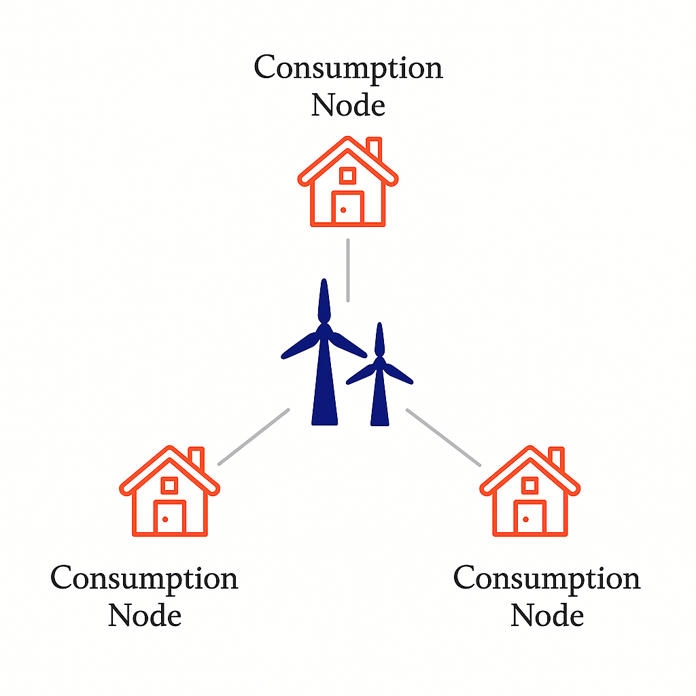
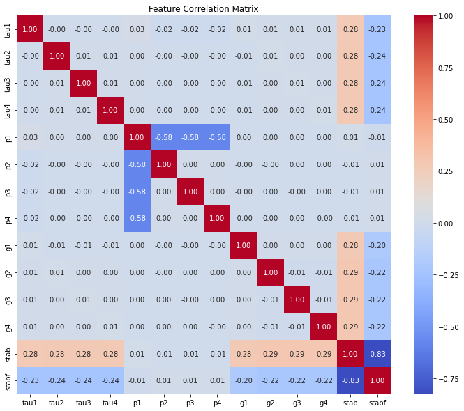
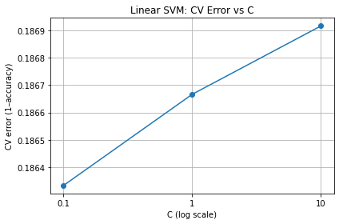
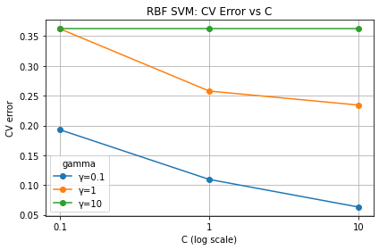
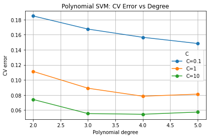
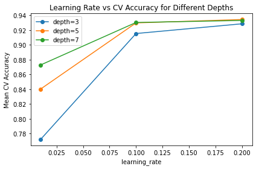
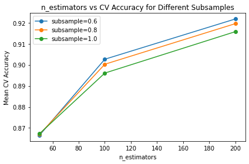
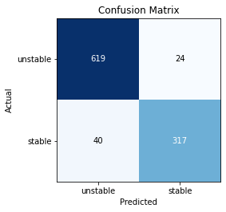
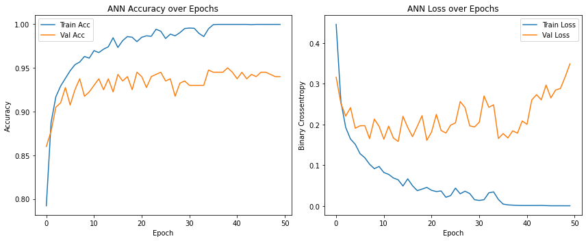
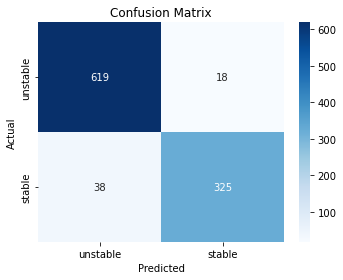

# ⚡ Decentralized Smart Grid Stability Prediction

> Pattern Recognition & Machine Learning — Universitat Politècnica de Catalunya  
> Author · Mohammad Alikhani Najafabadi • mohammad.najafabadi@estudiantat.upc.edu

This repository contains code, data, and experiments for predicting stability in a **Decentral Smart Grid Control (DSGC)** system using machine-learning and deep-learning models (SVM, Gradient Boosting, and Artificial Neural Networks).  
Our best model (ANN) reaches **94 % accuracy** on a 60 k-sample dataset derived from 4-node DSGC simulations.

---

## 📚 Table of Contents
1. [Background](#background)
2. [DSGC Mathematical Model](#dsgc-mathematical-model)
3. [Dataset](#dataset)
4. [Exploratory Data Analysis](#exploratory-data-analysis)
5. [Methodology](#methodology)
6. [Results](#results)
7. [How to Run](#how-to-run)
8. [References](#references)

---

## 🧠 Background
Smart grids are evolving from unidirectional energy delivery to **bidirectional networks with “prosumers.”**  
Monitoring grid **frequency** is key: excess generation raises frequency; shortages lower it. The DSGC framework links **real-time pricing** to local frequency measurements, but the original differential-equation model relies on simplifying assumptions (“fixed-inputs” & “equality” issues).  
We replace that fragile analytical model with data-driven predictors.

<!-- Centered, 260-px wide -->

   
  Figure&nbsp;1&nbsp;&mdash;4-node DSGC

---

## ⚙️ DSGC Mathematical Model

#### Core power-balance (producer / consumer $j$), follows the equations below:

$$
p^{\text{source}} = p^{\text{accumulated}} + p^{\text{loss}} + p^{\text{consumed}}
$$

$$
p^{\text{source}}
  = \tfrac12\ M_j \ \frac{d}{dt}\bigl(\delta_j'\bigr)^{2} + \kappa_j \sum_{k=1}^{N} K^{\max}_{jk} sin(\delta_k-\delta_j)
$$

**where:**

- $$M_j$$ — moment of inertia  
- $$\delta_j'$$ — rotor angle velocity  
- $$K_j$$ — friction coefficient  
- $$K^{\max}_{jk}$$ — maximum transmittable power  
- $$\delta_j, \delta_K$$ — rotor angles of machines *j* and *k*

#### Frequency and Phase dynamics:

- Grid frequency deviation is defined as $$\omega_j = \frac{d}{dt} \delta_j$$, from a reference grid rotating at $$\Omega = 2\pi \cdot 50 \, \text{Hz},$$  with the phase given by $$\delta_j(t) = \omega t + \theta_j(t),$$ where $$\omega$$ is the grid frequency and $$\theta_j(t)$$ is the relative rotor angle.

$$
\frac{d^{2}\delta_j}{dt^{2}} = P_j - \alpha_j\frac{d\delta_j}{dt} + \sum_{k=1}^{N} K_{jk}\sin(\delta_k-\delta_j)
$$

**where:**

- $$P_j$$ — mechanical power (positive for production, negative for consumption)  
- $$\alpha_j = \frac{2\kappa_j}{M_j}$$ — damping factor  
- $$K_{jk}$$ — coupling strength

With reaction-time delay $$\tau_j$$ and price elasticity $$\gamma_j$$ the full model becomes:

$$
\frac{d^{2}\delta_j}{dt^{2}} = P_j - \alpha_j\frac{d\delta_j}{dt} + \sum_{k}K_{jk}\sin(\theta_k-\theta_j) - \gamma_j\\frac{d}{dt}\bigl[\theta_j(t-\tau_j)-\theta_j(t-\tau_j-T_j)\bigr].
$$

A negative maximum eigenvalue of the Jacobian ⇒ **stable** grid.

---

## 📊 Dataset

| Field(s) | Description | Range |
|----------|-------------|-------|
| `tau1`…`tau4` | Reaction times | 0.5 – 10 s |
| `p1`…`p4` | Nominal power (producer positive, consumers negative) | –2 … +6 |
| `g1`…`g4` | Price elasticity | 0.05 – 1.0 |
| `stabf` | **Target** — binary {`stable`, `unstable`} | 36 % / 64 % |

*Original 10 000 simulated runs → **6× augmentation** by exploiting star-grid symmetry ⇒ **60 000 samples** (54 k train / 6 k test).*

---

## 🔍 Exploratory Data Analysis

**Correlation Analysis**: 
The examination identified a significant negative correlation (**–0.83**) between the target variable `'stabf'` and the twelve numerical features, suggesting that higher feature values are associated with unstable conditions.  
Moreover, above-average correlations were noted between `'p1'` and its components `'p2'`, `'p3'`, and `'p4'`.  
Despite these correlations, the values were not high enough to justify feature removal, as each feature provides unique insights crucial for understanding the dataset’s structure.
  

<!-- Centered, 260-px wide -->

   
  Figure&nbsp;1&nbsp;&mdash;correlation matrix

---

## 🛠️ Methodology

### 1 · Pre-processing
* **StandardScaler** fitted on training fold then applied everywhere (no leakage).  
* Stratified train / test split preserves class ratios.

### 2 · Models & Hyper-tuning

| Model | Key search grid | CV folds |
|-------|-----------------|----------|
| **SVM** | kernel ∈ {linear, poly, rbf}; C ∈ {0.1, 1, 10}; γ, degree | 5 |
| **XGBoost** | `n_estimators`, `max_depth`, `eta`, `subsample`, … | 5 |
| **ANN** | 12 → 288 → 288 → 24 → 12 → 1 (sigmoid) &nbsp;•&nbsp; Nadam • 50 epochs | 10 |

RandomizedGridSearch ⟶ best hyper-set per model.

---

## 🧪 Results

| Model | Best CV Acc (%) | Test Acc (%) |
|-------|-----------------|--------------|
| SVM (RBF kernel) | 94.0 | 93.9 |
| XGBoost | 93.8 | 93.6 |
| ANN | **94.6** | **94.4** |

<table>
  <tr>
    <td align="center">
       
      <em>Figure 3 — Linear SVM</em>
    </td>
    <td align="center">
       
      <em>Figure 4 — RBF SVM</em>
    </td>
    <td align="center">
       
      <em>Figure 5 — Polynomial SVM</em>
    </td>
  </tr>
</table>

<table>
  <tr>
    <td align="center">
       
      <em>Figure 6 — Learning Rate Vs CV Accuracy for XGboost Model</em>
    </td>
    <td align="center">
       
      <em>Figure 7 — N estimator Vs CV Accuracy for XGboost Model </em>
    </td>
    <td align="center">
       
      <em>Figure 8 — Confiusion Matrix for XGboost Model </em>
    </td>
  </tr>
</table>

<table>
  <tr>
    <td align="center">
       
      <em>Figure 9 — ANN Accuracy & Loss over epochs </em>
    </td>
    <td align="center">
       
      <em>Figure 10 — Confiusion Matrix for ANN Model </em>
    </td>

</table>

---

# 🧠 Discussion & Recommendations

The selected architecture — four hidden layers with decreasing width and Nadam optimization — effectively models grid stability with strong accuracy and balanced precision–recall.  
A slight training–validation loss gap suggests that applying **early stopping** or **weight decay** may reduce overfitting.  

Importantly, **false negatives** (unstable conditions classified as stable) impact the model more than false positives.  
Thus, boosting **recall for the unstable class**, even at some precision cost, may be beneficial.  
Future work should explore **dropout tuning** and **class-weighted loss functions** to enhance recall.

